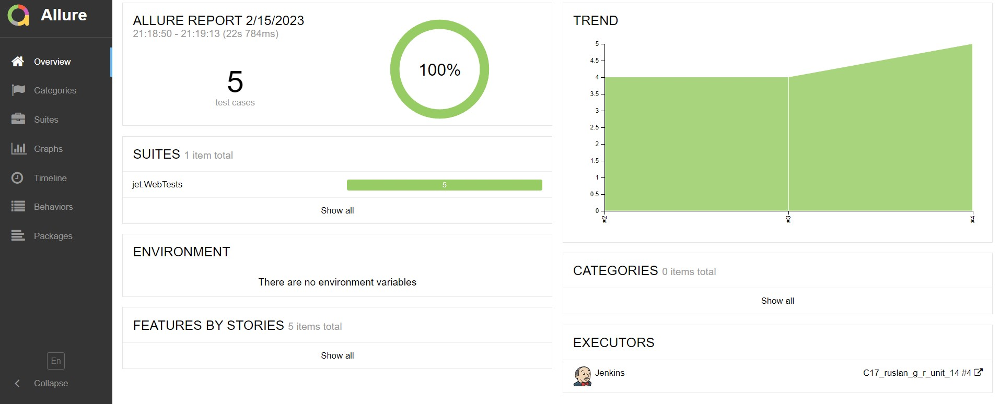
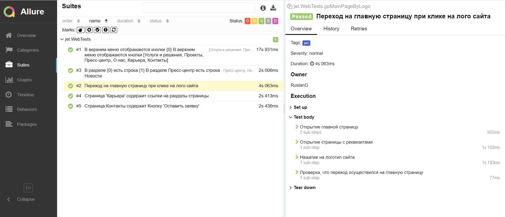
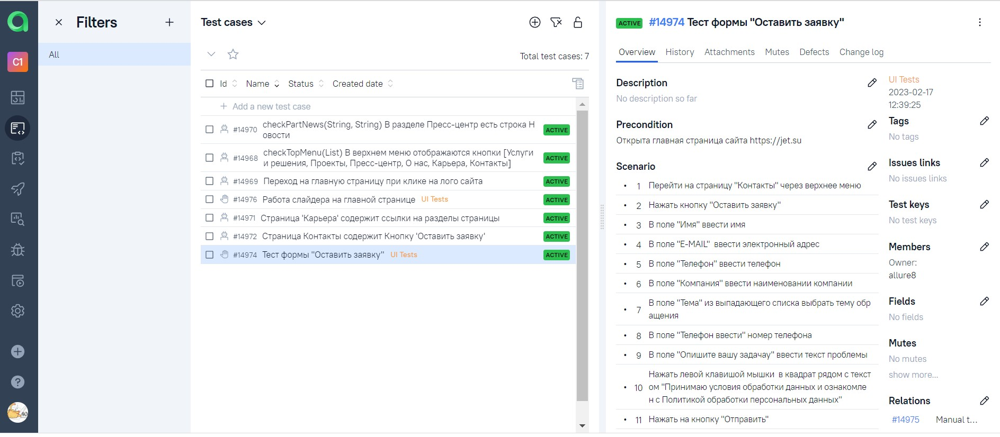
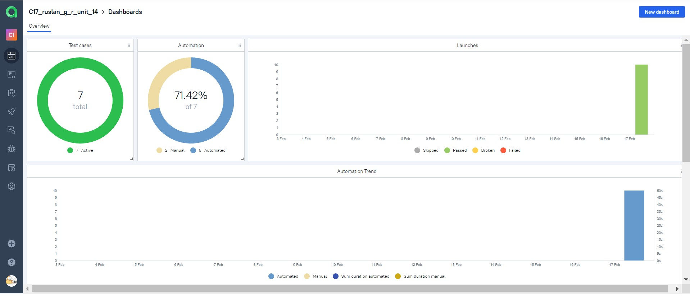
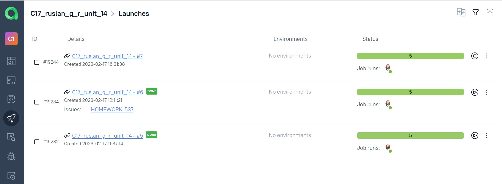
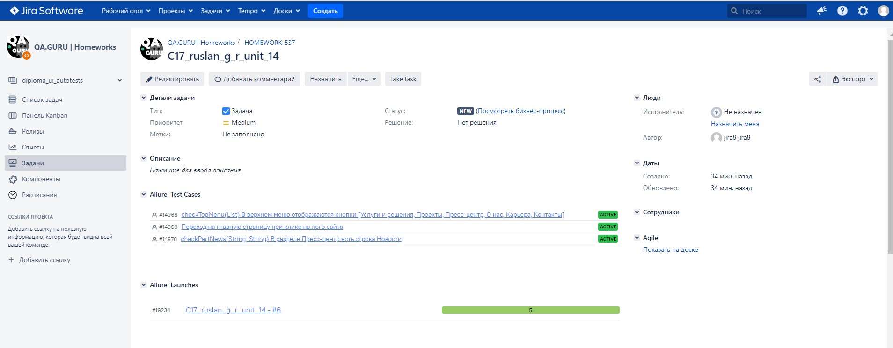
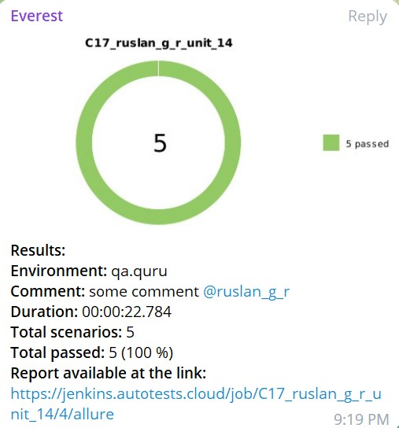

# :stars: Проект по автоматизации тестирования для Инфосистемы Джет
<a target="_blank" href="https://jet.su">Веб сайт Инфосистемы Джет</a>
## :card_file_box: Содержание
- [Технологии и инструменты](#bookmark-технологии-и-инструменты)
- [Запуск из терминала](#bookmark-запуск-тестов-из-терминала)
- [Сборка в Jenkins](#bookmark--jenkins--job-)
- [Allure отчет](#bookmark--отчет-в-allure-report)
- [Уведомление в Telegram](#bookmark--уведомление-в-telegram)
- [Видео прохождения тестов](#bookmark--видео-прохождения-некоторых-тестов)

## :bookmark: Технологии и инструменты
<p align="center">
<a href="https://www.jetbrains.com/idea/"></a>
<a href="https://www.java.com/"></a>
<a href="https://github.com/"></a>
<a href="https://junit.org/junit5/"></a>
<a href="https://gradle.org/"></a>
<a href="https://selenide.org/"></a>
<a href="https://aerokube.com/selenoid/"></a>
<a href="https://github.com/allure-framework/allure2"></a>
<a href="https://www.jenkins.io/"></a>
<a></a>
</p>

## :bookmark: Запуск тестов из терминала
Локальный запуск:
```
gradle clean jet_test
```

Удаленный запуск:
```
clean
jet_test
-Dbrowser=${BROWSER}
-DbrowserVersion=${BROWSER_VERSION}
-DbrowserSize=${BROWSER_SIZE}
-Dremote=${REMOTE}
```
## </a> Allure отчет <a target="_blank" href="https://jenkins.autotests.cloud/job/IBS_test/allure/"></a>

## ⛅: Основной отчет
<p align="center">

</p>

## 🧪: Пример тест кейса
<p align="center">

</p>

## </a> Интеграция с Allure TestOps <a target="_blank" href="https://allure.autotests.cloud/project/1858/dashboards"></a>

## :pinching_hand:: Пример ручного тест-кейса
<p align="center">

</p>

## :bar_chart:: Доска
<p align="center">

</p>

## :runner:: Прогоны
<p align="center">

</p>

## </a> Интеграция с Jira <a target="_blank" href="https://jira.autotests.cloud/browse/HOMEWORK-519"></a>

<p align="center">

</p>

## </a> Уведомления в телеграм с использованием бота

<p align="center">

</p>

## </a> Selenoid. Пример прогона тестов. <a target="_blank" href="https://selenoid.autotests.cloud/gif/example.gif"> </a>

<p align="center">
 
</p>